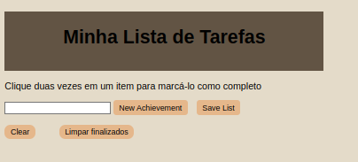

# Project Todo List

Esse é o projeto da sessão 5 do curso de **Desenvolvimento Web** da [trybe](https://www.betrybe.com/).

## Projeto

Este projeto é uma página web, que representa uma lista de tarefas, sendo possível adicionar e remover tarefas.




## 🧑‍💻 Técnicas e Tecnologias

As técnicas e tecnologias utilizadas no projeto são:

- `HTML`
- `CSS`
- `JavaScript`

## 📲 Executando o projeto

### ✔️ Pré-requisitos

Para conseguir seguir este README e rodar o projeto você pode precisar dos seguintes itens:
- Git para clonar o projeto e acessar as branches. Você pode instalar [aqui](https://git-scm.com/downloads);

Se quiser testar as instalações, rodar os comandos abaixo separadamente deve mostrar as respectivas versões.

```
git --version
```


### 🐙 Clonando o projeto

Para ter acesso aos arquivos do projeto você pode clonar usando o seguinte comando:

```
git clone git@github.com:SamuelR499/todo-list.git
```

### ▶️ Rodando o Projeto

Agora que já tem a pasta do projeto na sua máquina, você pode usar a extensão do VsCode [LiveServer](https://github.com/ritwickdey/vscode-live-server) para executar o `index.HTML` em um navegador.

--

Uma guia no navegador irá abrir, geralmente [neste endereço](http://localhost:3000/).

Pronto, agora você consegue acessar a pagina.
